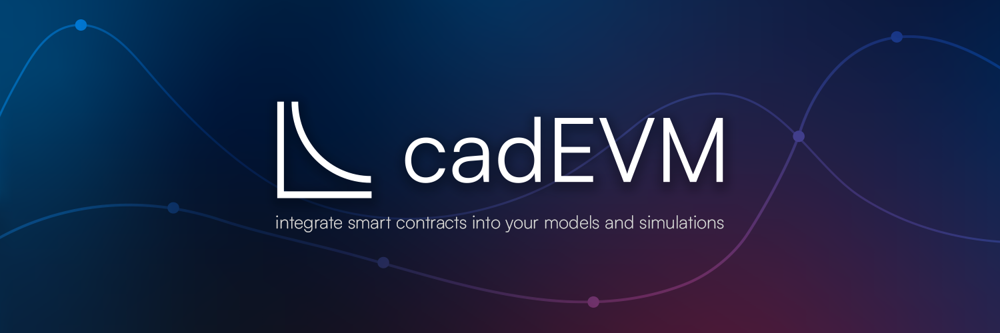

# cadEVM - a library to streamline developing of radCAD models on the EVM. 



## Table of Contents

- [Project Description & Goals](#project-description--goals)
- [Installation](#installation)
- [Usage](#usage)
- [Roadmap & Plans](#roadmap--plans)
- [Contributing](#contributing)


## Project Description & Goals
### Descrption
cadEVM is an user-friendly pip library developed in order to streamline developing of radCAD models on the Ethereum Virtual Machine.

It relies on [Ape framework](https://github.com/ApeWorX/ape) developed by ApeWorx & [radCAD](https://github.com/CADLabs/radCAD) developed by CadLabs and focuses on the ease-of-use for the token engineer & mechanism designer familiar with cadCAD/radCAD. 

As the framework uses a lot of Ape framework & radCAD at this stage, familiarity with these frameworks are a requirement. 


### Goals

1. Enable ease of use for Token Engineers to use EVM
2. Enable mechanism & scenario testing of smart contracts via using radCAD & EVM out of the box
3. Simulate a live environment via forking that ensures getting the same type of errors form the network.
4. Create an open source EVM framework for creating Models that Token Engineers can easily use, especially those familiar with cadCAD/radCAD (de facto industry standard tooling)


## Installation 

- Clone the repo
- Enter the terminal
- Create a venv in the project directory via `python -m venv venv`    
- activate it via        `source venv/bin/activate`
- run `pip install .` in the cadEVM directory to install cadEVM

## Usage

### Initialization

In the directory of your choice, in the terminal run: `cadEVM init`


You will be prompted to:
1. Enter the name of your project
2. Are your contracts deployed or not 
3. Do you use Alchemy or Infura
4. Do you want to install recommended Ape plugins.Afterwards it will install hardhat as the default fork provider in the project directory.


If you do not have a project already deployed, the cadEVM project will be initialized like a standard Ape framework project & it is up to the token engineer to run the script to deploy the contracts (easy deployer is going to be developed)

If you have the project already deployed you can use the ape Contract instance and add the abi manually or `ape-etherscan` (comes with the default) plugin to fetch the abi from etherscan. Afterwards you can use the `generate_initial_state` from the helpers module to generate the initial_state_variables based on the view methods of the contract. Using `ape-accounts` you can generate accounts/agents that will interact with the deployed contract.

### Token Template  [POC]

In the directory of your choice run: `cadEVM token-template`. It will download the template that serves as a proof of concept for this library. It will download all the necessary plugins, all you need to do is get an [Alchemy API key](https://www.alchemy.com/) as the template uses Alchemy. If you would like to use Infura you can change the ape-config.yaml as follows:

```yaml name: Token template
plugins:
- name: alchemy
- name: hardhat
- name: tokens
- name: etherscan
- name: solidity
- name: vyper
hardhat:
  fork:
    ethereum:
      mainnet:
        upstream_provider: infura #instead of alchemy
        enable_hardhat_deployments: true
```

In order to understand the rationale, template contains smart contracts & a  python notebook to demonstrate the usage of of this library on both previously developed contracts (DAI stablecoin contract) & contracts that are not yet deployed on the network. It uses hardhat to fork the Ethereum mainnet.

## Roadmap & Plans

1. Create more modules that will make cadEVM more configurable, both in terms of initialization & usage
2. Create modules that will tackle agent based properties and enable easy creation of different types of agents based on assumptions or on the current state of the network
3. Create modules that track transaction fees, certain points of interests etc. 
4. Be less dependent on the other frameworks & libraries
5. Make the technicalities such as deploying the contracts, contract details more intuitive and easy to use

## Contributing

For those willing to contribute:

1. **Fork the Repository**: To contribute to this project, start by forking the repository to your GitHub account.
2. **Make Changes**: Implement your enhancements or fix issues in your forked repository, and ensure your changes align with the project's goals.
3. **Submit a Pull Request**: Once satisfied with your changes, submit a pull request, detailing the modifications made and addressing any relevant issues. Your contributions are highly appreciated!


